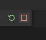

# 02_hello_astro_typescript

:memo: [éditer cette page](https://gitlab.com/-/ide/project/webdev101/webdev101.gitlab.io/edit/main/-/public/02_hello_html_typescript/README.md)

## lire et comprendre

vous devez lire et comprendre le code source de `index.html` que voici

[index.html](index.html ":include :type=code html")

vous devez ensuite lire et comprendre le code source de `app.ts` que voici

[app.ts](app.ts ":include :type=code typescript")

## transpiler

transpilez dans un terminal avec

```terminal
tsc app.ts
```

le fichier `app.js` est créé, il sera exécuté dans le navigateur lors de l'ouverture de `index.html`

en effet, le script transpilé `app.js` est lié au fichier `index.html` grâce à cette balise

```html
<script src="app.js"></script>
```

## exécuter dans un navigateur sans serveur 

Vous allez ouvrir le fichier `index.html` directement dans un navigateur. Pour cela, vous pouvez simplement faire un clic droit sur le fichier `index.html` dans l'explorateur de fichiers de votre système d'exploitation, puis choisir "Ouvrir avec" et sélectionner le navigateur Chrome. Vous verrez dans la barre d'adresse du navigateur une notation "fichier" au début de l'adresse, cela signifie que vous ouvrez un fichier local (il n'y as pas de serveur).
Vérifiez que vous voyez `Hello, hello TYPESCRIPT World!` dans la page web.

## exécuter dans un navigateur avec un serveur ASTRO

### Installation de Astro

Vous devez d'abord démarrer un serveur local, pour cela nous allons utiliser Astro.
Une bonne pratique avec VSCode est d'ouvrir chaque dossier de TP ou de projet dans une nouvelle fenêtre de VSCode. Cela permet de garder les configurations de débogage séparées et de ne pas mélanger les fichiers de différents TP ou projets.
Pour cela, ouvrez d'abord un nouvelle fenêtre VSCode (Fichier > Nouvelle fenêtre) et ouvrez le dossier 02_hello_astro_typescript dans cette nouvelle fenêtre. (fichier > ouvrir un dossier, ouvrez le dossier 02_hello_astro_typescript).
Dans le dossier 02_hello_astro_typescript, exécutez la commande

```terminal
bun create astro@latest
ATTENTION: pour certains processeurs (ARM) en cas d'erreur, essayez avec npm au lieu de bun
```

Répondez aux questions dans le terminal pour créer un projet Astro dans le dossier courant.
La première question "Where should we create your new project?" doit être répondue par `02_votre_nom` pour créer un nouveau dossier dans lequel sera créé la structure d'un projet ASTRO.
Pour les questions suivantes:
```terminal
How would you like to start your new project? A basic, minimal starter
Install dependencies? Yes
Initialize a new git repository? Yes
```

### Démarrer le serveur Astro en ligne de commande

Dans le terminal, allez dans le dossier du projet ASTRO nouvellement créé et exécutez la commande

```terminal
bun dev
```

Le serveur astro est lancé et vous verrez dans le terminal:
    
```terminal
 astro  v5.2.5 ready in 155 ms

┃ Local    http://localhost:4321/
```

Vous pouvez alors vous connecter à l'adresse http://localhost:4321/ dans votre navigateur pour voir votre application Astro en cours d'exécution.

Vous devriez voir "Astro Homepage : To get started, open the src/pages directory in your project."

### Configuration de Astro

Astro utilise un système de fichiers pour organiser les pages et les composants. Les fichiers dans le dossier `src/pages` correspondent aux différentes pages de votre application. Les fichiers dans le dossier `src/components` correspondent aux composants réutilisables de votre application. Les fichiers dans le dossier `src/layouts` correspondent aux mises en page de votre application. Les fichiers dans le dossier `src/assets` correspondent aux fichiers statiques de votre application (images ou autres fichiers).

Astro utilise le langage de balisage Astro pour définir les pages. Le langage de balisage Astro est similaire à HTML, mais avec quelques différences. Par exemple, les balises Astro sont des balises HTML standard, mais avec des fonctionnalités supplémentaires comme la possibilité d'importer des composants Astro dans une page Astro.
La structure de base d'une page Astro est divisée en deux parties séparées par `---`. La première partie est appelée "frontmatter" et contient des métadonnées sur la page. La deuxième partie est appelée "content" et contient le contenu de la page.
Le "frontmatter" est facultatif, mais il est souvent utilisé pour définir des métadonnées comme le titre de la page ou d'autres informations utiles pour la page. Si du code est écrit dans le "frontmatter", il va être exécuté "côté serveur" avant que la page ne soit envoyée au navigateur. Cela peut être utile pour charger des données dynamiques ou effectuer d'autres opérations côté serveur avant que la page ne soit affichée. Le "content" est le contenu de la page qui sera affiché dans le navigateur, si des balises script sont utilisées dans le "content", elles seront exécutées "côté client" dans le navigateur.

Il est très important de comprendre quand votre code s'exécute côté serveur ou côté client, car cela peut avoir un impact sur le comportement de votre application.

Créez un dossier `scripts` dans le dossier `src` qui contiendra les scripts exécutés côté client. Déplacez le fichier `app.ts` dans ce dossier. 

Changez le contenu du fichier `src/pages/index.astro`, effacez la partie "frontmatter" mais gardez les trois tirets `---` du début et de la fin, puis effacez le contenu de la partie "content" et remplacez-le par le contenu du fichier `index.html` fourni.

Changez la ligne `<script src="app.js"></script>` par `<script src="../scripts/app.ts"></script>`. Il y a deux changements: l'ajout du dossier ../scripts, et le fichier est "app.ts" au lieu de "app.js". En effet, astro va transpiler le fichier TypeScript en JavaScript et le servir à la place du fichier TypeScript.

Le fichier final devrait ressembler à ceci:

```astro
---

---

<!DOCTYPE html>
<html lang="en">

<head>
    <meta charset="UTF-8">
    <meta name="viewport" content="width=device-width, initial-scale=1.0">
    <title>WebDev101 Telecom Paris</title>
</head>

<body>
    <script src="../scripts/app.ts"></script>
    
</body>

</html>
```

Astro est capable de relancer le serveur automatiquement lorsqu'un fichier est modifié. Vous pouvez voir dans le terminal que Astro a détecté un changement et a rechargé la page automatiquement. Faites le test en modifiant le fichier `app.ts` et en enregistrant les modifications. Vous devriez voir dans le terminal quelque chose comme:

```terminal
09:37:21 [watch] src/scripts/app.ts
```

### Démarrer le serveur Astro dans VSCode en mode debug

L'initialisation de Astro va créer une configuration de débogage Astro dans le fichier `.vscode/launch.json` qui ressemble à ceci: 

```json
{
  "version": "0.2.0",
  "configurations": [
    {
      "command": "./node_modules/.bin/astro dev",
      "name": "Development server",
      "request": "launch",
      "type": "node-terminal"
    }
  ]
}
```

ATTENTION: le dossier .vscode doit être à la RACINE du dossier ouvert par VSCode. C'est à dire qu'il faut faire Fichier > Ouvrir un dossier et choisir celui que vous avez créé pour votre projet ASTRO où le dossier .vscode a été créé.

Dans le menu à gauche de VSCode, cliquez sur l'icône de débogage - une icône en forme de flèche avec un insecte dessus (ou appuyez sur F5). Choisissez la configuration "Development server", puis cliquez sur la flèche verte ou appuyez sur F5 pour démarrer l'exécution. 

Dans VSCode cliquer sur le carré rouge pour arrêter le serveur astro, ou la flèche ronde verte pour redémarrer le programme du début



Rappelez-vous qu'il n'y a pas besoin de recharger la page dans le navigateur, Astro va le faire automatiquement pour vous. Aussi, chaque changement dans les fichiers sera détecté par Astro et le serveur sera redémarré automatiquement donc il y a peu de chance de devoir redémarrer le serveur manuellement.

### Console et devtools du navigateur

Vous pouvez ouvrir la "console" du navigateur dans les "devtools" de votre navigateur en appuyant sur F12 ou clic droit sur la page > Inspecter, puis en cliquant sur l'onglet Console vous verrez les messages de débogage.
En particulier, tous les messages `console.log` de votre code TypeScript (ou Javascript) seront affichés dans la console du navigateur.

# Exercice

- créer une application web servie avec Astro, en TypeScript qui affiche "Bonjour, TypeScript!" dans la page web:
  - créer programmatiquement (depuis le script TypeScript) un div avec un id "app"
  - créer un h1 avec le texte "Bonjour, TypeScript!"
  - ajouter le h1 dans le div
  - ajouter le div dans le body
- Démarrez un serveur avec astro et déboguez dans Chrome votre application.