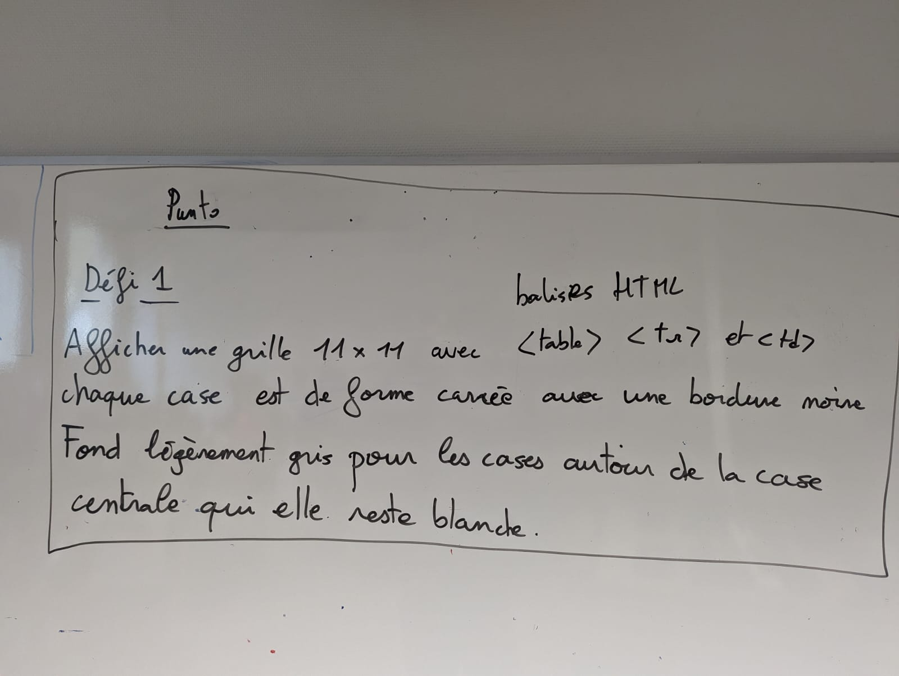
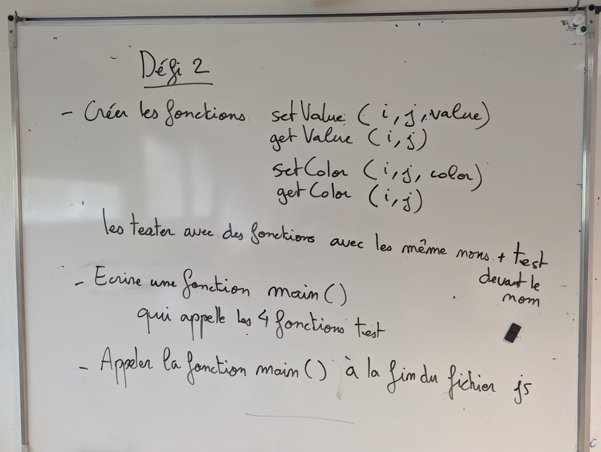
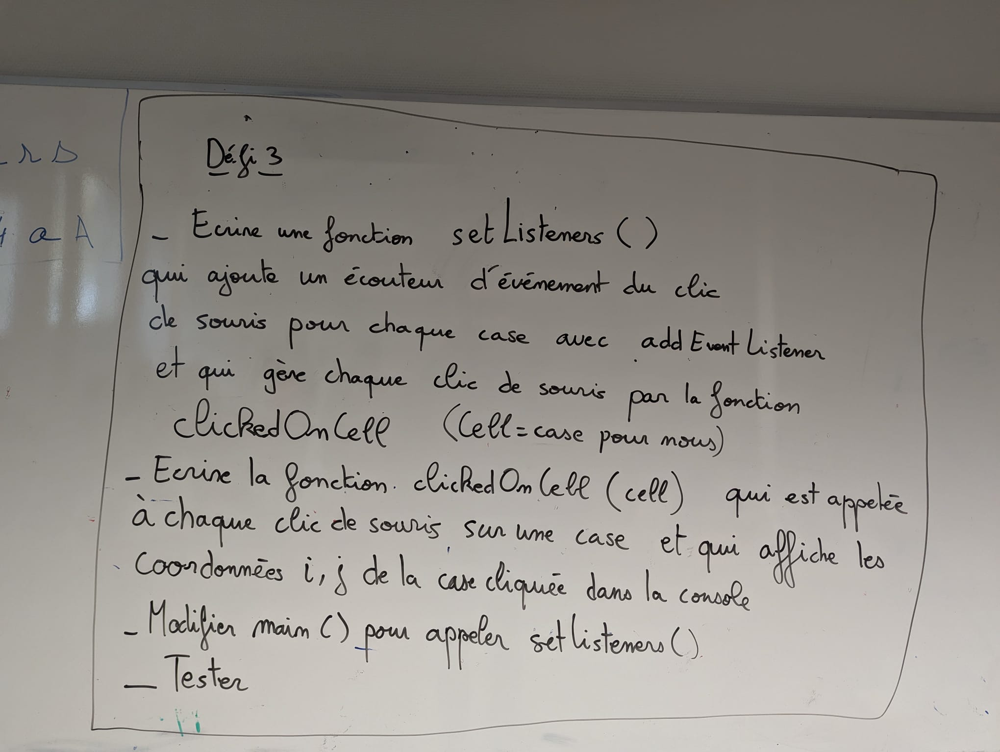
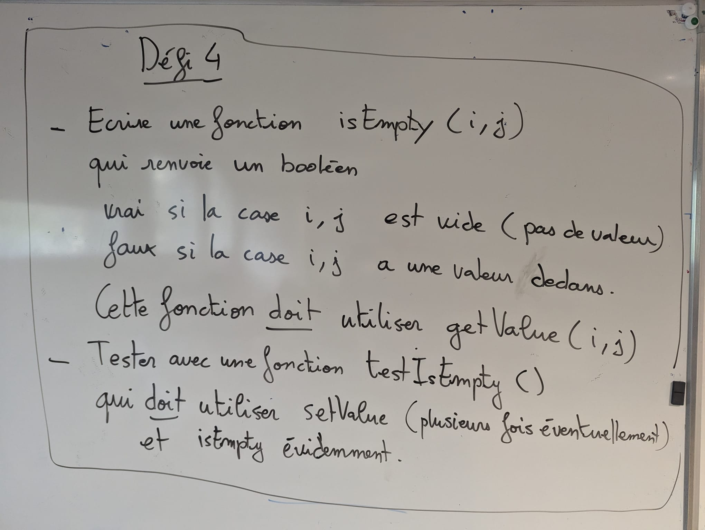
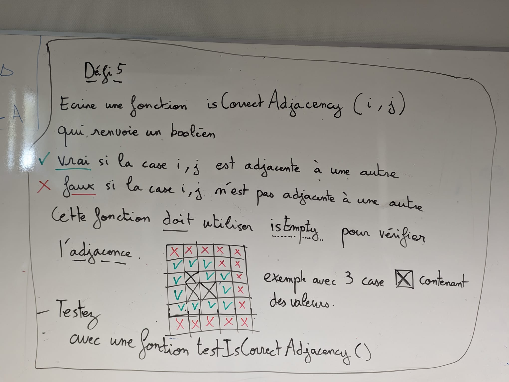
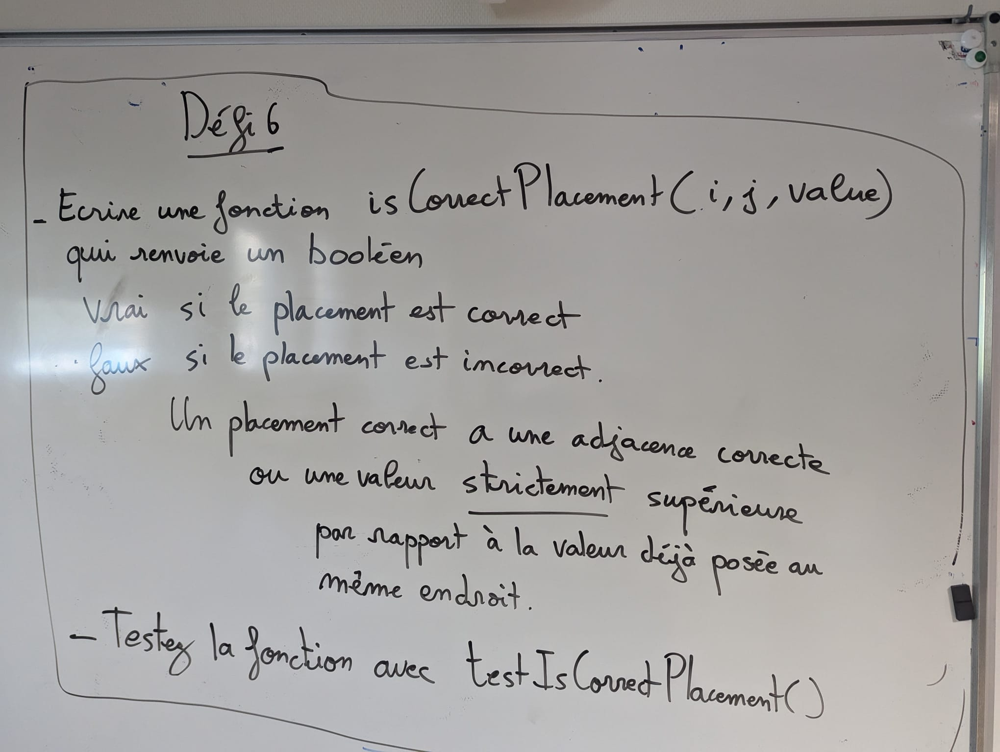
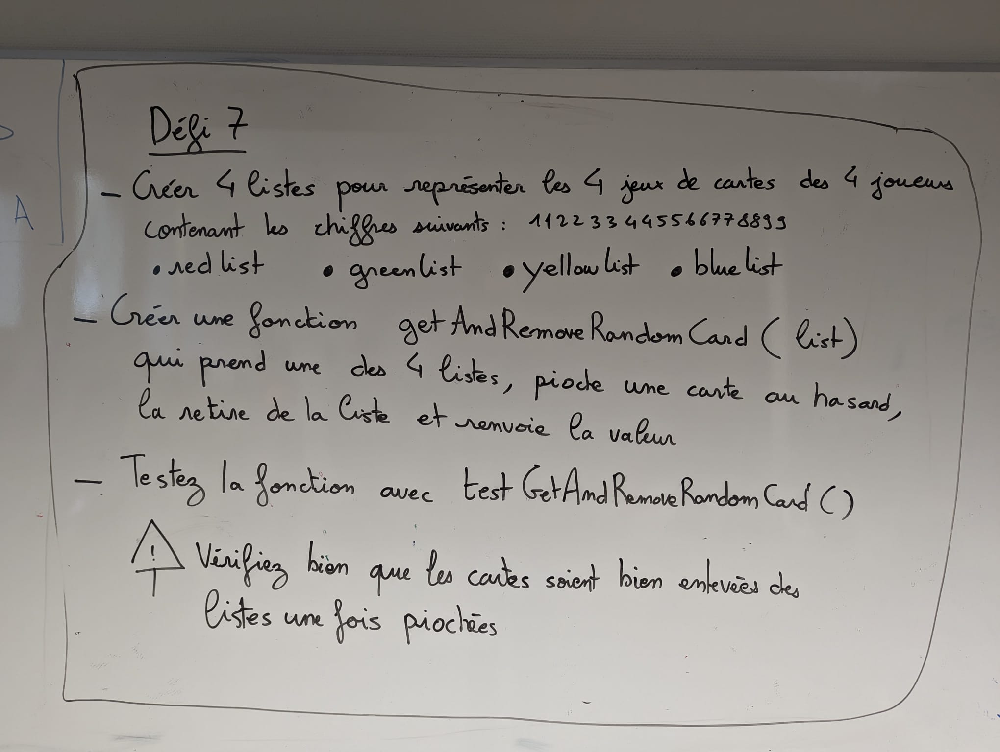
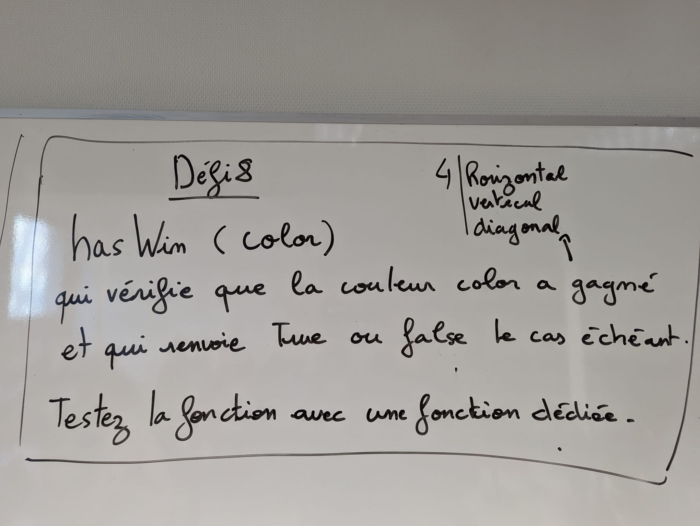
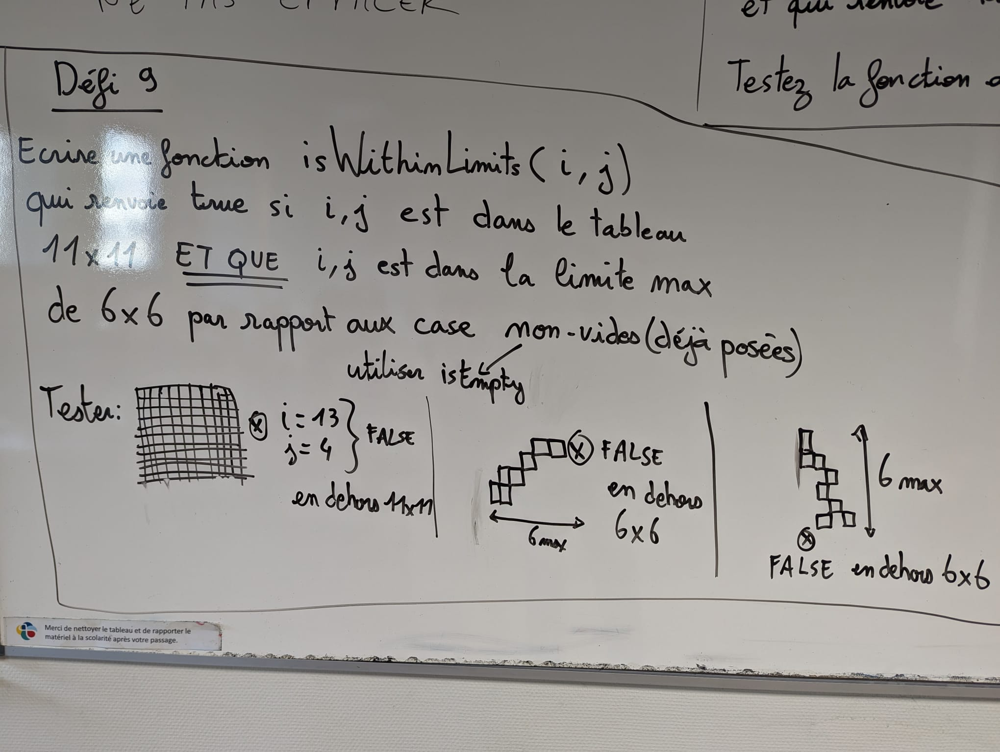

# 05 Html Css PUNTO

:memo: [éditer cette page](https://gitlab.com/-/ide/project/webdev101/webdev101.gitlab.io/edit/main/-/public/05_html_css_punto/README.md)

## micro-projet jeu PUNTO

Un site important de ressource est celui de MDN (Mozilla Developer Network) :
https://developer.mozilla.org/fr/

Vous aurez en particulier besoin de voir la doc pour les balises HTML suivantes: html, body, a, table, tr, td, div, span; 
aussi vous aurez besoin des fonctions javascript addEventListener() et getElementById()
enfin, côté CSS : les sélecteurs CSS et quelques propriétés comme color, border, width...

Votre but dans ce micro-projet est de développer le jeu PUNTO avec des technologies web : HTML/CSS/Typescript et un serveur Astro. Cela vous permettra de vous familiariser avec ces technologies.

Faites en sorte que l'intégralité du code soit exécuté dans le navigateur (côté client) et non pas sur le serveur.

## défis du micro-projet

